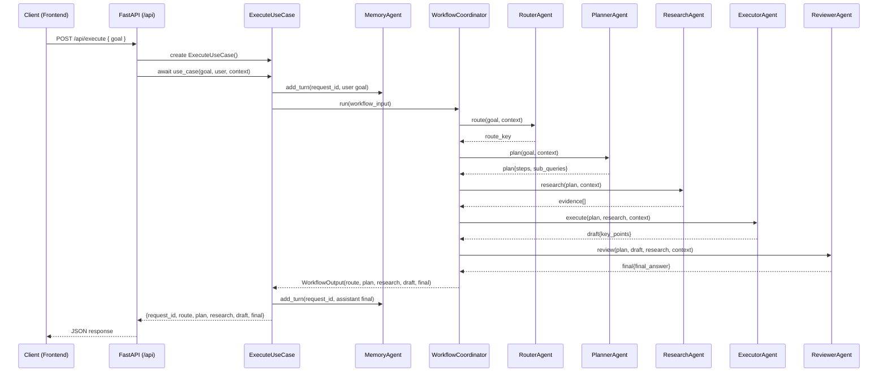

# Sequence Diagram (HTTP + Agent Pipeline)

```mermaid
sequenceDiagram
    participant Client as Client (Frontend)
    participant API as FastAPI (/api)
    participant UseCase as ExecuteUseCase
    participant Mem as MemoryAgent
    participant WF as WorkflowCoordinator
    participant Router as RouterAgent
    participant Planner as PlannerAgent
    participant Research as ResearchAgent
    participant Executor as ExecutorAgent
    participant Reviewer as ReviewerAgent

    Client->>API: POST /api/execute { goal }
    API->>UseCase: create ExecuteUseCase()
    API->>UseCase: await use_case(goal, user, context)

    UseCase->>Mem: add_turn(request_id, user goal)
    UseCase->>WF: run(workflow_input)

    WF->>Router: route(goal, context)
    Router-->>WF: route_key

    WF->>Planner: plan(goal, context)
    Planner-->>WF: plan{steps, sub_queries}

    WF->>Research: research(plan, context)
    Research-->>WF: evidence[]

    WF->>Executor: execute(plan, research, context)
    Executor-->>WF: draft{key_points}

    WF->>Reviewer: review(plan, draft, research, context)
    Reviewer-->>WF: final{final_answer}

    WF-->>UseCase: WorkflowOutput(route, plan, research, draft, final)

    UseCase->>Mem: add_turn(request_id, assistant final)
    UseCase-->>API: {request_id, route, plan, research, draft, final}
    API-->>Client: JSON response
```

