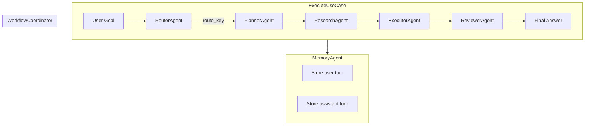

# Workflow Diagram (Agent Pipeline)

```mermaid
flowchart TD
    A[User Goal] --> B[RouterAgent]
    B -->|route_key| C[PlannerAgent]
    C --> D[ResearchAgent]
    D --> E[ExecutorAgent]
    E --> F[ReviewerAgent]
    F --> G[Final Answer]

    subgraph UseCase[ExecuteUseCase]
        A
        B
        C
        D
        E
        F
        G
    end

    subgraph Orchestration[WorkflowCoordinator]
        B
        C
        D
        E
        F
    end

    subgraph Memory[MemoryAgent]
        M1[Store user turn]
        M2[Store assistant turn]
    end

    UseCase --> Memory
```

